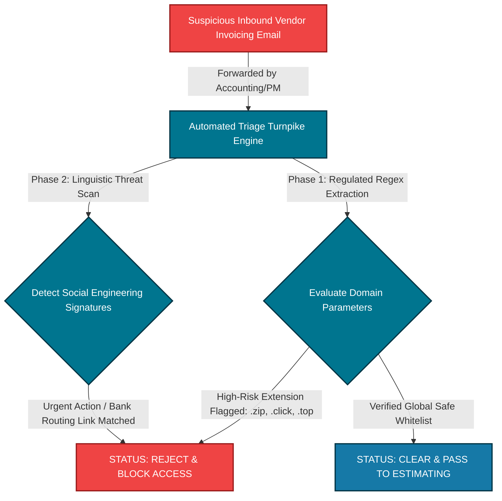

# Hi there, I'm Tony Gagliano 👋

## 🛡️ Founder & Principal Security Architect | VaultMedia Security LLC
I am a military veteran, systems engineer, and the founder of **VaultMedia Security LLC** based in Colorado Springs, CO. I specialize in designing, auditing, and hardening high-availability enterprise infrastructure, secure cloud-native networks, and automated perimeter monitoring pipelines for mid-market general contractors, specialty trades, and independent commercial lines insurance brokerages.

Our mission at **VaultMedia Security** is absolute loss prevention: we eliminate the unmanaged network entry pathways, session token exploits, and data leaks that lead to devastating, six-figure invoice redirection wire fraud and lateral ransomware contamination before assets cross our clients' corporate boundaries.

Secure the perimeter, insulate the corporate cash flow!

---

## 🚀 Professional Core Competencies

| Enterprise Infrastructure Hardening | Regulatory Compliance & Triage | SIEM & Threat Monitoring |
| :--- | :--- | :--- |
| • Cloud Architecture & Web Server Hardening • Layer 4 & Layer 7 Load Balancing Clusters • Network Segment & Endpoint Isolation • Filesystem Least-Privilege Enforcements | • Advanced Vulnerability Profiling • CMMC 2.0 Framework Self-Assessments • NIST SP 800-171 Regulatory Audits • External Access Control List (ACL) Tuning | • Real-Time Splunk Telemetry Design • Python Security Scrapers & Automation • Threshold Intrusion Alert Scripting • Git Version Control Operations |

---

## 🛡️ Inbound Revenue Protection Architecture (Sponsorship & Vendor Gatekeeper Engine)

An enterprise-tier automated triage engine engineered to neutralize phishing, credential harvesting, and session-token theft vectors targeting commercial builders, supply chain links, and project management ecosystems.

### 📊 The Infrastructure Bottleneck Strategy (The Turnpike)
Commercial construction businesses lose critical revenue when team members interact directly with unverified external communication links or spoofed invoicing threads. This framework establishes an automated technical gatekeeper on the network perimeter. Every incoming vendor proposal, subcontractor file package, or remote hyperlink string must pass through this triage engine for structural validation before accessing internal communication tiers.

---

## 🧰 Technical Capability Matrices
*   **Static Domain Whitelisting Mapping:** Instantly separates verified, authoritative corporate developers and insurance carriers from dynamic, adversarial infrastructure.
*   **High-Risk TLD Filtering:** Automatically identifies and flags dangerous domain structures (e.g., `.zip`, `.click`, `.top`) heavily favored by modern infostealer malware distributions.
*   **Linguistic Behavioral Analysis:** Scans invoice body text components for high-pressure social engineering telemetry to protect your company's digital session keys.

---

## 🔬 Featured Technical Security Assets & Labs

### 📡 [VaultMedia Core Automated Job Sector Scanner]
*A proprietary Python-driven security framework built to intercept, extract, and analyze public employment boards for commercial infrastructure software tags.*
*   **The Problem:** Scaling construction firms frequently broadcast their exact expanding cloud attack surface to adversaries by listing mandatory software proficiencies on open boards.
*   **The Architecture:** Deploys automated regular-expression parsing filters and string token analysis via BeautifulSoup4 to triage local job descriptions, automatically flagging firms matching critical cloud software indicators (e.g., `Procore`, `Sage 300`, `Autodesk BIM 360`) to build high-priority risk-insulation campaigns.

### 🌐 [High-Availability IIS Web Server Load Balancing Deployment]
*A comprehensive engineering write-up and scripting repository configuring fault-tolerant web server farms on Windows Server 2019 environments.*
*   **The Problem:** Commercial project management portals and blueprint directories cannot afford a single point of failure or downtime during high-velocity bidding windows.
*   **The Architecture:** Integrates Microsoft Application Request Routing (ARR) 3.0 proxies and Weighted Round-Robin load distribution algorithms. Configures continuous automated health tests to dynamically re-route traffic completely away from failing server nodes in milliseconds, maintaining absolute user uptime and eliminating database exposure.

---

## 🎓 Certifications & Training
*   🏅 **ISACA Certified Information Systems Auditor (CISA)** – Professional Target Pathway
*   🏅 **ISC2 Certified Information Systems Security Professional (CISSP)** – Executive Roadmap
*   🏅 **CompTIA Security+** – Technical Infrastructure Baseline
*   🎓 **A.S. Information Technology** – Full Sail University, 2026
*   🎓 **B.S. Cybersecurity** – Full Sail University, 2027 *(Current Enrolled Track)*

---

## 🛠️ Tech Stack & Toolbelt

### Operating Systems & Infrastructure Virtualization
*   **Kali Linux** / **Parrot OS** / **Windows Server 2019** / **Docker** / **Ansible**

### Core Languages, Relational Databases & Web Architecture
*   **Python** / **Bash Scripting** / **LAMP Stack** / **MySQL** / **MariaDB** / **HTML5 & CSS3**

### Engineering, Testing & Log Monitoring Utilities
*   **Splunk Enterprise** / **Dashboard Studio 2.0** / **Wireshark** / **Nmap** / **Git Version Control**

---

## 🤝 Connect With My Lab
*   💼 **LinkedIn:** [://linkedin.com](https://://linkedin.com) 
*   🌐 **Corporate Showroom:** [https://vaultmediasecurity.com](https://vaultmediasecurity.com)
*   📬 **Secure Inquiries:** [tony@vaultmediasecurity.com](mailto:tony@vaultmediasecurity.com)
